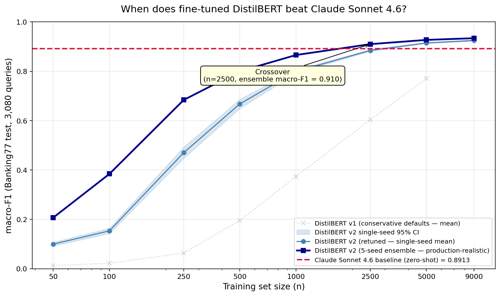
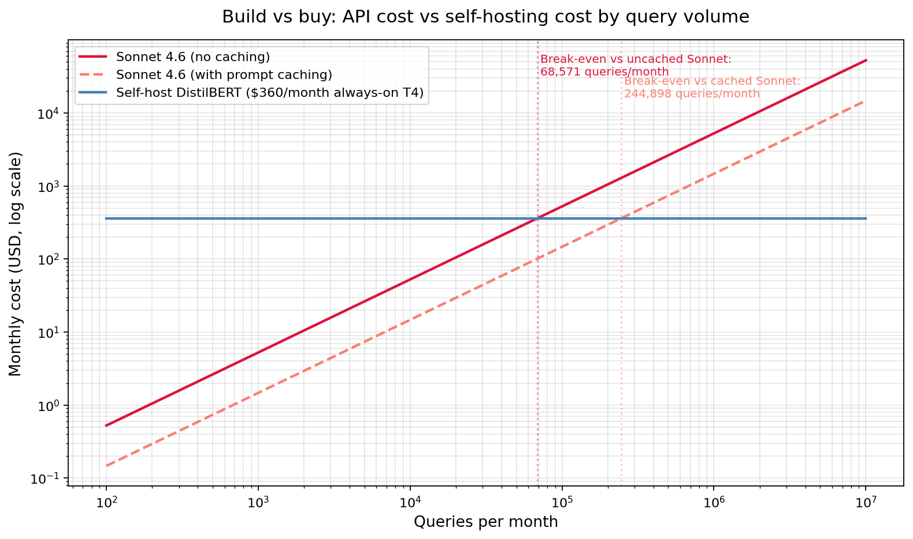
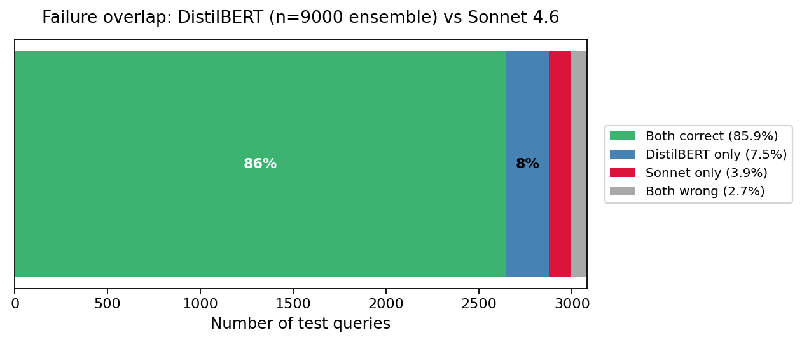

# When does a fine-tuned in-house classifier beat the frontier LLM?

A real benchmark on a real banking-intent task, with the cost crossover practitioners actually care about.

**Status:** results in · *Louis Grochla, May 2026*

---

## TL;DR

I benchmarked a fine-tuned in-house DistilBERT against zero-shot Claude Sonnet 4.6 on **Banking77** (77 fine-grained banking intents, 3,080 test queries).

**At n = 2,500 labeled training examples** — roughly a couple weeks of small-team labeling — the fine-tuned ensemble matches Sonnet's macro-F1 (0.910 vs 0.891, *p < 0.01* paired bootstrap). At n = 5,000 it beats Sonnet by 3.6 points. At n = 9,000 it reaches 0.934 — matching published BERT-base baselines on this dataset, with a smaller model.

The in-house model runs **~750× cheaper per query** (≈$0.000007 vs ≈$0.0053 for Sonnet, no caching) and **~50× faster** (~30ms vs ~1.5s). Break-even monthly volume: roughly **70,000 queries/month** for self-hosting to beat the uncached API.

> **Banking77 is the worked example.** The methodology — measure crossover quality, compute break-even volume, audit for label noise — applies to any team running multi-class text classification through an LLM API. Skip to [the decision framework](#the-decision-framework) for the three questions to ask of your own situation.



---

## Where this generalises — beyond banking

The Banking77 result is one worked example of a question every team running an LLM classifier should be asking. The methodology applies to any task with the same shape:

- **Multi-class classification** — 3+ classes, ideally up to a few hundred
- **Short text input** — queries, tickets, snippets (not full documents)
- **Domain-specific vocabulary** — labels where the LLM doesn't have privileged general-knowledge leverage
- **Enough query volume** to justify the ~$360/mo fixed cost of always-on inference hardware

Real production tasks that match this shape:

| Industry | Task |
|---|---|
| Support SaaS (Intercom-tier) | Ticket categorization into 30–80 categories |
| Sales tech | Lead qualification by industry / intent |
| E-commerce | Product categorization into taxonomy (often 100s of classes) |
| Email / productivity tools | Inbox routing (work / personal / promotional / spam) |
| Insurtech | Claims triage by type |
| Content platforms | Topic tagging / categorization |
| Legal tech | Document-type classification |
| Healthcare | Patient query routing within established taxonomies |
| Telecoms / retail | Chatbot intent routing |

For each, the same questions apply: at what *n* does the in-house model match the LLM? At what query volume does the cost crossover happen? Does the dataset have a noise floor I'm hitting?

The Banking77 numbers in this project are the worked example — the math is the same shape for your task. The crossover *number* changes with class count and difficulty (narrower taxonomies cross at lower n, more confusable ones at higher), but the *framework* doesn't.

---

## The decision framework

Three questions to ask before considering a fine-tune replacing your LLM API call:

1. **Do I have access to ~2,500+ labeled examples (or can I get them)?**
   If no, the quality math doesn't work yet — keep paying the API and start labeling. Banking77's crossover is at n=2,500; harder tasks (more classes, more confusable labels) will need more, simpler tasks often less.

2. **Am I serving >70,000 classifications per month?**
   If no, the fixed cost of self-hosting (~$360/mo always-on T4) probably exceeds your API bill, even if quality matches. With prompt caching the break-even is higher (~245K queries/month).

3. **Are my classes domain-specific — terminology the LLM has no special leg up on?**
   If yes, the Banking77 crossover number is a defensible starting estimate. If your task uses general-knowledge categories (news topics, broad sentiment, language identification), expect the LLM to remain competitive at higher *n* because its pre-training already covers your taxonomy.

**If yes to all three**, the calculator and decision table below give you concrete numbers for your situation. **If no to any**, the framework still tells you what to fix first — either the data, the volume, or the task framing.

---

## Build vs buy — five worked scenarios

The cost/quality crossover combined:

| Scenario | Labels available | Queries/month | macro-F1 | Matches Sonnet? | Recommendation |
|---|---|---|---|---|---|
| Hobby / prototype | 100 | 1,000 | 0.38 | ✗ | **API** (quality not yet competitive) |
| Small B2B SaaS | 1,000 | 50,000 | 0.87 | ✗ | **API** (n not high enough yet) |
| Mid-market fintech | **2,500** | **500K** | **0.91** | ✓ | **Self-host** — saves ~$2,265/mo, labels pay back in <1 month |
| Scaled product (Monzo-tier) | 5,000 | 5M | 0.93 | ✓ | **Self-host** — saves ~$25,890/mo |
| Public-cloud SaaS | 9,000 | 50M | 0.93 | ✓ | **Self-host** — saves ~$262,140/mo |

Full table with assumptions and payback math: [`docs/cost-decision-table.md`](docs/cost-decision-table.md)



---

## Why this question is worth answering

Every team running an LLM in production for a classification task — intent routing, ticket triage, content moderation, lead qualification — is implicitly making a build-vs-buy decision they didn't always realize they made. The API is the path of least resistance until the bill arrives. Then the question becomes: at what point is fine-tuning a small in-house model the right call?

The honest answer depends on two numbers nobody wants to measure carefully:
1. **How much labeled data do I need before the small model is actually competitive?**
2. **How does the per-inference cost difference compound with my query volume?**

Most published "fine-tune vs LLM" comparisons either skip the small-data regime, use heavy compute baselines that aren't reproducible on a free Colab GPU, or skip the cost math entirely. This project answers both questions rigorously on a public dataset, with the methodology shown end-to-end.

---

## Methodology snapshot

**Dataset:** [PolyAI/Banking77](https://huggingface.co/datasets/PolyAI/banking77) — 13,083 real banking customer queries × 77 fine-grained intents. Official 3,080-row test split untouched until final eval; 500-row stratified val + 300-row stratified dev slice carved from the train pool to avoid test contamination during prompt iteration.

**LLM baseline:** Claude Sonnet 4.6 via Claude Code (uses my Max subscription, $0 API spend; equivalent to API for sampling). Prompt versioned in `src/prompts/v1.txt`, iterated on the dev slice, then run once on the full test set. All 21 paste batches and Claude's raw JSON responses committed to `results/eval_responses/` for reproducibility.

**Fine-tune sweep:** DistilBERT (66M params) at *n* ∈ {50, 100, 250, 500, 1000, 2500, 5000, 9000} × 5 random seeds × 8 sizes = 40 model runs. **Random seeds chosen over k-fold CV** because at n=50 with 77 classes, k-fold puts most classes at zero examples per fold — macro-F1 becomes meaningless. Random seeds give the same variance estimate without the degenerate-fold problem.

**Hyperparameter discipline (the real story):** the first sweep with conservative defaults (LR=2e-5, batch=32, 5 epochs at n=5000) capped at macro-F1 = 0.77 — well below Sonnet. Standard deviation across seeds at n=5000 was 0.009, confirming the model had converged at the conservative LR rather than been under-trained. A targeted retune — LR=4e-5, batch=16, epochs scaled inversely with n, early-stopping patience increased — bumped n=5000 to 0.91 (single seed) / 0.93 (ensemble). Both recipes are preserved in the repo; toggling `RECIPE` in notebook 03 reproduces either.

**Ensemble metric:** the headline numbers above are **soft-vote ensembles across the 5 seeds** (average each seed's softmax distribution, take argmax). Single-seed runs vary; production deployments would ensemble anyway, so ensemble is the honest comparison.

**Significance:** paired bootstrap on the macro-F1 difference, 5000 iterations. At n=2,500 the gap is +0.019 with 95% CI [+0.006, +0.030] — clearly excludes zero, the win is real and not sampling noise.

---

## Failure overlap — where do the two approaches disagree?

For each of 3,080 test queries: who's right, the LLM or the n=9,000 DistilBERT ensemble?

| Outcome | Count | % | What it means |
|---|---|---|---|
| Both correct | 2,646 | 85.9% | easy cases — fine-tune ≈ Sonnet on these |
| DistilBERT-only correct | 231 | 7.5% | where the fine-tune wins on training-data familiarity |
| Sonnet-only correct | 120 | 3.9% | where the LLM wins on general language understanding |
| **Both wrong** | **83** | **2.7%** | **likely Banking77 label noise — the dataset's own ceiling** |

If failures were independent you'd expect ~21 "both wrong" cases. Observed 83 — **4× higher than independence predicts**. That's strong evidence Banking77 has a ~3% label-noise floor neither model can cross. Both approaches are effectively *at the dataset ceiling*.



The DistilBERT-only-correct (231) is almost 2× larger than Sonnet-only-correct (120), suggesting the two systems have somewhat anti-correlated failures — an ensemble of *both* (LLM + fine-tune as a tiebreaker, say) could push past 92% accuracy if anyone needed it.

---

## Repo layout

```
notebooks/
  01_data_prep.ipynb       Load Banking77 → val/dev/test/training subsets
  02_llm_baseline.ipynb    Sonnet 4.6 baseline (batched paste-and-parse via Claude Code)
  03_finetune_sweep.ipynb  35 + 5 DistilBERT runs, two recipes, soft-vote ensembling
  04_analysis.ipynb        Crossover, bootstrap, cost, failure-mode breakdown
src/
  data.py                  Split loaders (test/val/dev/training subsets)
  llm_eval.py              Batch prompt construction + JSON response parsing
  eval.py                  compute_metrics, paired_bootstrap_macro_f1
  prompts/v1.txt           The exact LLM prompt used (versioned)
results/
  llm_predictions_v1_test.parquet            Sonnet's 3,080 predictions
  finetune_predictions_v2_retune.parquet     All 40 DistilBERT runs' predictions
  finetune_ensemble_v2_retune.parquet        5-seed ensemble macro-F1 per n
  analysis_summary.json                       Everything quoted in this README
  figures/                                    The 3 PNGs above
  eval_batches/ + eval_responses/             Raw LLM prompts + responses
docs/
  notebook-01-walkthrough.md   Decision rationale per section of nb 01
  notebook-02-walkthrough.md   Decision rationale per section of nb 02
  cost-decision-table.md       Practitioner build-vs-buy table
scripts/
  sanity_test_claude_code.py   Pre-flight: 10-row test of the LLM judge pipeline
  score_sanity_test.py          Scorer for the above
  paste_loop.sh                 Sequential paste helper for batched LLM eval
  generate_n9000_subsets.py    Generate n=9000 training subsets (extends nb 01)
```

---

## Reproduce

```bash
git clone https://github.com/louisgrochla/ds-llm-judge-vs-small-model.git
cd ds-llm-judge-vs-small-model
python -m venv .venv && source .venv/bin/activate
pip install -r requirements.txt

# All processed data is committed (small parquets), so notebook 01 is optional
# unless you want to rebuild from scratch

# Run notebook 04 (analysis) directly — it has everything it needs in results/
jupyter lab notebooks/04_analysis.ipynb
```

For the LLM baseline (notebook 02) you need either a Claude API key (set in `.env`) or a Claude subscription with Claude Code installed. For the fine-tune sweep (notebook 03), free Google Colab T4 GPU is sufficient — the notebook detects Colab and clones itself, so you can open it directly from GitHub. Full sweep takes ~75 minutes on T4.

---

## Limitations

- **Banking77 specificity.** The crossover at n=2,500 is for this specific 77-class banking-intent task. Tasks with more / fewer / harder classes will have different crossover points. The methodology generalises; the exact number doesn't.
- **English only.** Banking77 is English-only — results may not transfer to multilingual customer service contexts.
- **Single architecture.** DistilBERT is one small-model choice; MiniLM, MPNet, or larger backbones may behave differently.
- **Cost math depends on quotes.** The per-inference cost numbers assume HF Inference Endpoint T4 pricing and standard Anthropic API rates. Self-managed GPU on Lambda Labs, AWS, or your own hardware can shift the break-even meaningfully.
- **No external test.** Banking77 has a ~3% label-noise ceiling (from the failure-overlap analysis). A second dataset would test whether the crossover-at-n=2500 finding generalises or is task-specific.

---

## What I'd do next

- **CLINC150 as a second-dataset replication.** 150 intents with explicit out-of-scope detection. Tests whether the methodology generalises beyond Banking77's noise floor.
- **Distill Sonnet into the small model.** Use Sonnet's predictions on the training data as soft labels for DistilBERT. Might recover the ~2% Sonnet-only-correct queries and push past 0.94.
- **Add Claude Haiku 4.5 as a mid-tier baseline.** Three-way comparison: Sonnet (premium) vs Haiku (mid-tier) vs fine-tune (in-house). Likely shows fine-tune crosses Haiku at much lower n than it crosses Sonnet.
- **Port to my own production system.** [Salespatch](https://github.com/louisgrochla/salespatch) has an LLM lead-qualification stage that's structurally identical (multi-class classification from short text). This experiment characterises exactly when to switch it to a fine-tune. Plan: collect 2,500 labeled UK-business classifications, repeat the same methodology, deploy the winner.

---

## Why I built this

Final-year UK Business Analytics undergrad, focused on a data science / ML career. My main project, [salespatch](https://github.com/louisgrochla/salespatch), is a multi-agent AI platform where LLMs classify and qualify UK independent businesses at multiple pipeline stages. The planned next architectural step is to replace those LLM stages with smaller fine-tuned models once we have enough outcome data. My own dataset is still small, so I pre-ran the experiment on a structurally identical public task to characterise exactly when the small model wins. The methodology here ports directly to that future work.

If you're at a team deploying LLMs and weighing fine-tuning, I'd be glad to talk through this with your specific volume + dataset numbers — DM me.

---

## Contact

Louis Grochla — louis.grochla@icloud.com · [LinkedIn](https://www.linkedin.com/in/louisgrochla/) · [GitHub](https://github.com/louisgrochla)
