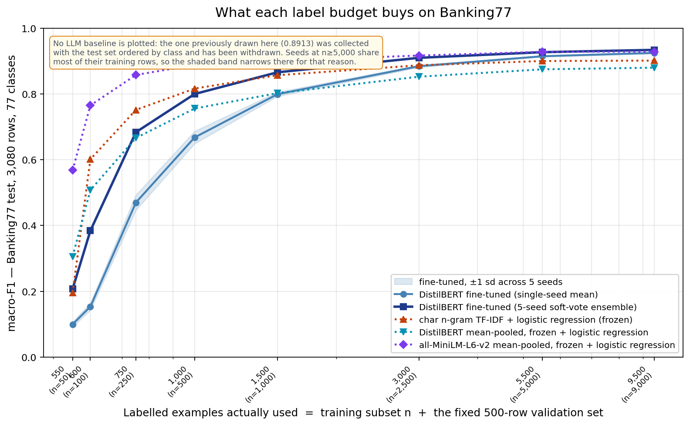
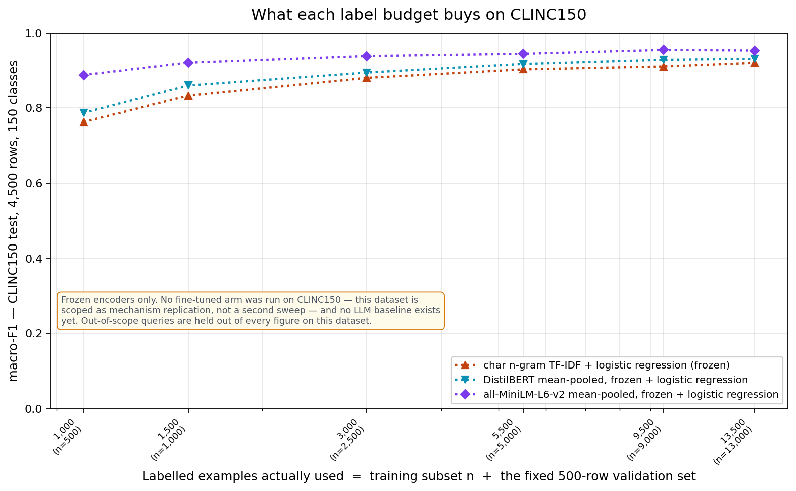

# When does a fine-tuned in-house classifier beat a frontier LLM?

A cost-and-quality study on a real banking-intent task — and a public account of what happened when the baseline turned out to be broken.

**Status:** LLM baseline under reconstruction · *Louis Grochla, updated 28 July 2026*

---

> ## Correction notice — 28 July 2026
>
> **The zero-shot LLM baseline in this repo is invalid. Every comparison against it is withdrawn.**
>
> The 3,080-row test set was sent to the model in batches of 150, **ordered by class**. Re-derived from the committed predictions: **76 label transitions across 3,080 rows** for 77 classes, where a random order gives ~3,040. Mean distinct intents per batch: **4.4**. One batch contained 2 intents and scored 1.000.
>
> The model was therefore never doing 77-way classification. Each prompt implicitly narrowed the candidate set to roughly four labels. **0.8913 is not a measurement of zero-shot per-query performance and cannot be reported as one.**
>
> Withdrawn as a consequence: the crossover claim, the build-vs-buy recommendations, the failure-overlap analysis, and the cost comparison's quality premise.
>
> **What still stands:** the fine-tuning sweep — 8 label budgets × 5 seeds × 2 recipes — never involved the LLM and is unaffected. So is the decision *framework*. What does not stand is any sentence of the form "the small model matches the LLM at n = X".
>
> Reproduce the diagnosis in about a minute: `python scripts/verify_handover_claims.py`.
> The rebuilt baseline — one query per call, closed-enum structured outputs, shuffled order, ≥3 runs, measured tokens and latency — lives in [`src/harness/`](src/harness/).

---

## What this repo currently supports

**Stands (measured, reproducible from committed artifacts):**

- A fine-tuning sweep of DistilBERT (66M) across *n* ∈ {50, 100, 250, 500, 1000, 2500, 5000, 9000} × 5 seeds × 2 hyperparameter recipes.
- **Fine-tuning never significantly beats not fine-tuning on this task** — see below. This is the strongest result in the repo and it was found while rebuilding the baseline.
- A large and under-reported **seed-ensembling effect at low budgets**: at n=100, single-seed macro-F1 averages 0.153 while the 5-seed soft-vote ensemble reaches 0.384. Low-resource single-seed numbers are unstable to a degree the literature rarely reports.
- The observation that **hyperparameter defaults dominate small-data results**: a conservative recipe capped at 0.77 macro-F1 at n=5000; a targeted retune moved the same data and model to 0.91.
- A build-vs-buy **framework** whose arithmetic is sound and whose inputs are stated below.

**Does not stand:**

- Any comparison to the LLM (see the correction notice).
- The latency claim. **No latency measurement exists anywhere in this repo.** `notebooks/02_llm_baseline.ipynb` says so in its own text: *"I lose per-call latency measurements."* The previously published "~50× faster (~30ms vs ~1.5s)" was never measured and has been removed.
- Any *p*-value. `src/eval.py` computes bootstrap confidence intervals only; no significance test is implemented. The previously published "*p* < 0.01" has been removed.



*Regenerate with `python scripts/make_figures.py`. The older `results/figures/crossover.png` is kept for provenance but has the withdrawn 0.8913 baseline drawn across it — do not use it.*

---

## The result that survived the rebuild: fine-tuning didn't earn its keep

While rebuilding the LLM baseline, the obvious missing control got added — a **frozen** encoder with a linear head, no fine-tuning at all. It should have been in the original study. Comparing it against the fine-tuned DistilBERT ensemble, with a paired approximate-randomisation test on macro-F1 (10,000 permutations, 3,080 test rows):

| Labels (n) | Frozen MiniLM + logistic regression | Fine-tuned DistilBERT (5-seed) | Gap | *p* |
|---|---|---|---|---|
| 50 | **0.5679** | 0.2071 | **+0.3608** | 0.0001 |
| 100 | **0.7653** | 0.3842 | **+0.3812** | 0.0001 |
| 250 | **0.8578** | 0.6837 | **+0.1741** | 0.0001 |
| 500 | **0.8885** | 0.7999 | **+0.0886** | 0.0001 |
| 1,000 | **0.9006** | 0.8658 | **+0.0349** | 0.0001 |
| 2,500 | 0.9168 | 0.9098 | +0.0070 | 0.113 |
| 5,000 | 0.9282 | 0.9271 | +0.0012 | 0.771 |
| 9,000 | 0.9285 | 0.9340 | −0.0054 | 0.180 |

**Fine-tuning DistilBERT does not significantly beat a frozen `all-MiniLM-L6-v2` with logistic regression at any label budget on Banking77.** Below n=2,500 it loses, badly — by 38 macro-F1 points at n=100. At and above 2,500, including at the largest budget, the two are statistically indistinguishable.

Even **character n-gram TF-IDF** — no neural network at all, seconds to train on a laptop CPU — beats the fine-tuned model at n=100 (+0.217, *p*=0.0001), n=250 (+0.068) and n=500 (+0.016), ties at n=1,000 (*p*=0.15), and trails by only 2–3 points thereafter.

Why this matters more than the original question: the study set out to find the budget at which a fine-tuned small model catches a frontier LLM. But there is a prior question — *does fine-tuning beat not fine-tuning?* — and on this task, in the low-budget regime where the whole "how many labels do I need" question lives, it does not. A comparison that pits an LLM against a fine-tuned transformer without this control is measuring tuning effort as much as method.

Reproduce (no API key, a few minutes on CPU):

```bash
python scripts/run_frozen_encoder.py --encoder tfidf distilbert minilm
python scripts/reanalysis.py
```

Caveats stated up front: this is one dataset; the frozen arms tune only an inverse-regularisation constant on the same 500-row validation set the fine-tuned arm uses for early stopping, so both are charged the same extra supervision; and `all-MiniLM-L6-v2` was itself trained on a large sentence-pair corpus, which is pre-training the fine-tuned DistilBERT did not get. That last point is the interesting one, not a confound to apologise for — *choosing an encoder whose pre-training matches your task* appears to buy more than fine-tuning a worse-matched one.

### Reproducibility note

Getting these numbers stable required fixing something worth stating, because it is a trap for anyone benchmarking frozen encoders. **Transformer embeddings are not a pure function of the input text when you batch them.** Padding length depends on which texts share a batch, and floating-point non-associativity does the rest. Rebuilding the text pool from a different set of files — identical texts, different order — perturbed the embeddings enough to flip one cell's regularisation choice on a near-tie, moving a published ensemble figure by 0.004.

The first fix attempted was a tolerance rule on the regularisation search. Testing showed it bought nothing: at realistic noise scale every selection rule flips 0 of 120 cells. It was removed rather than left in looking like a safeguard. The actual fix is one line — sort the text list before encoding — which makes embeddings a function of the text set alone. TF-IDF results are now bit-identical across runs and across a filesystem move.

---

## Second taxonomy: CLINC150

Scoped as mechanism replication, not a second study — 150 in-scope intents, 6 budgets × 3 seeds, frozen arms only. The 1,000 out-of-scope test queries are held out of every macro-F1 here; they carry a different sampling density and would let one anomalous class move the headline.

| Labels (n) | TF-IDF | Frozen DistilBERT | Frozen MiniLM |
|---|---|---|---|
| 500 | 0.7629 | 0.7871 | **0.8878** |
| 1,000 | 0.8328 | 0.8599 | **0.9207** |
| 2,500 | 0.8802 | 0.8943 | **0.9385** |
| 5,000 | 0.9027 | 0.9172 | **0.9445** |
| 9,000 | 0.9105 | 0.9285 | **0.9549** |
| 13,000 | 0.9201 | 0.9312 | **0.9532** |



The encoder ordering is identical to Banking77 — MiniLM > frozen DistilBERT > TF-IDF at every budget — so that ranking is not a Banking77 artifact. Absolute performance is higher, consistent with CLINC150 being the cleaner taxonomy.

The practitioner-facing number: **500 labels already buys 0.888 macro-F1 across 150 intents**, and going to 13,000 (26× the data) adds 0.065. Steep diminishing returns set in almost immediately.

What this does **not** yet show is whether fine-tuning fails to earn its keep here too — that needs a fine-tuned CLINC arm, which is a GPU sweep and out of scope. Stated plainly rather than implied.

---

## Measured serving cost and latency

The repo previously claimed "~50× faster (~30ms vs ~1.5s)" with **no measurement behind it anywhere**. Here are actual measurements. Per-query, end-to-end as a deployment would serve it, on an Apple Silicon laptop under a load average of 3.9 — so these are conservative:

| Arm | p50 (batch=1) | p95 | Batched queries/sec | $/1M queries | Hardware |
|---|---|---|---|---|---|
| TF-IDF + logreg | **1.0 ms** | 1.5 ms | 17,817 | $0.0008 | **CPU only** |
| Frozen MiniLM | 4.6 ms | 5.6 ms | 2,058 | $0.0675 | GPU |
| Frozen DistilBERT | 10.4 ms | 25.2 ms | 768 | $0.1809 | GPU |
| Fine-tuned DistilBERT | 7.6 ms | 11.4 ms | 780 | $0.1781 | GPU |

For comparison the API arm is ~$5,250 per 1M queries — but that figure is still **estimated from token counts, not measured**. It becomes measured when the rebuilt harness runs, since it records `usage` on every call.

**No "N× cheaper" ratio is quoted, deliberately.** At full utilisation the fixed cost amortises over so many queries that the ratio runs into the millions — arithmetically true, practically meaningless, and precisely the trap that produced this repo's four contradictory cost figures. What a practitioner can act on:

| Arm | Fixed $/month | Break-even vs API | Hardware |
|---|---|---|---|
| TF-IDF + logreg | $36 | **6,857 queries/mo** | CPU |
| Everything else | $360 | 68,571 queries/mo | GPU |

That order-of-magnitude gap is the real cost finding: **a bag of character n-grams needs no accelerator**, so it pays for itself ten times sooner than anything holding a GPU resident. Reproduce with `python scripts/cost_model.py` — it records the machine and its load average alongside the numbers, so a contended run can be spotted and discarded.

---

## Corrections log

Every claim below was published in this repo and was wrong. Listed so the record is auditable rather than quietly rewritten.

| Claim as published | Status | What is true |
|---|---|---|
| "matches Sonnet's macro-F1 (0.910 vs 0.891)" | **Withdrawn** | Baseline invalid (class-ordered collection). Separately, 0.910 is a 5-seed ensemble while the cost model prices one model; **0 of 5 single seeds** exceeded 0.8913 at n=2,500. |
| "*p* < 0.01 paired bootstrap" | **Removed** | No p-value is computed anywhere in the repo. Only 95% CIs exist. |
| "paired bootstrap … 5000 iterations" | **Corrected** | `results/analysis_summary.json` records `n_bootstrap: 2000` at every budget. The runs were 2,000. |
| "~50× faster (~30ms vs ~1.5s)" | **Removed** | Never measured. Notebook 02 states latency measurements were lost. |
| "~750× cheaper" / "500× at full utilisation" / "756×" / "7,560×" | **Reconciled to one figure** | ~756×, at 10% GPU utilisation, against the uncached API. See [Cost](#cost-one-figure-one-assumption). The "500× at full utilisation" line inverted the utilisation direction. |
| "matching published BERT-base baselines" (0.934 vs 93.66) | **Corrected** | Casanueva et al. 2020's 93.66 on Banking77 is **`bert-tuned` = BERT-*large*** (340M params) and the metric is **accuracy**, not macro-F1. Comparing a macro-F1 to an accuracy from a 5× larger model is a category error. Their frozen-BERT baseline is 87.19 accuracy. |
| "Prompt … iterated on the dev slice" | **Corrected** | `src/prompts/` contains exactly `v1.txt`. There was no prompt iteration; v1 went straight to test. |
| Failure-overlap / "~3% label-noise floor" | **Withdrawn** | The analysis uses the LLM's predictions. Because the LLM was solving an easier (≈4-way) task, its correct set is inflated and "both wrong" is undercounted — so the noise-floor estimate is biased in a known direction and cannot be quoted. |

---

## Where this generalises — beyond banking

The Banking77 result is one worked example of a question every team running an LLM classifier should be asking. The methodology applies to any task with the same shape:

- **Multi-class classification** — 3+ classes, ideally up to a few hundred
- **Short text input** — queries, tickets, snippets (not full documents)
- **Domain-specific vocabulary** — labels where the LLM doesn't have privileged general-knowledge leverage
- **Enough query volume** to justify the ~$360/mo fixed cost of always-on inference hardware

Real production tasks that match this shape:

| Industry | Task |
|---|---|
| Support SaaS (Intercom-tier) | Ticket categorization into 30–80 categories |
| Sales tech | Lead qualification by industry / intent |
| E-commerce | Product categorization into taxonomy (often 100s of classes) |
| Email / productivity tools | Inbox routing (work / personal / promotional / spam) |
| Insurtech | Claims triage by type |
| Content platforms | Topic tagging / categorization |
| Legal tech | Document-type classification |
| Healthcare | Patient query routing within established taxonomies |
| Telecoms / retail | Chatbot intent routing |

For each, the same questions apply: at what *n* does the in-house model match the LLM? At what query volume does the cost crossover happen? Does the dataset have a noise floor I'm hitting?

The Banking77 numbers in this project are the worked example — the math is the same shape for your task. The crossover *number* changes with class count and difficulty (narrower taxonomies cross at lower n, more confusable ones at higher), but the *framework* doesn't.

---

## The decision framework

Three questions to ask before considering a fine-tune replacing your LLM API call:

1. **How many labeled examples can I get?**
   This is the axis that matters, and the sweep below shows what quality each budget buys on this task. The *n* at which an in-house model reaches parity with a given LLM is exactly what this repo can no longer state — that number is pending the rebuilt baseline. Treat the quality curve as the input and supply your own parity target.

2. **Am I serving enough volume to clear the fixed cost of self-hosting?**
   Self-hosting trades a per-query bill for a fixed one. Break-even = fixed monthly cost ÷ per-query API cost. At the list prices below that is ~68,600 queries/month against the uncached API and ~245,000 with prompt caching — but both are arithmetic on quoted list prices, not on metered invoices.

3. **Are my classes domain-specific — terminology the LLM has no special leg up on?**
   If your task uses general-knowledge categories (news topics, broad sentiment, language identification), expect the LLM to stay competitive to higher *n*, because pre-training already covers your taxonomy. If your taxonomy is historically accreted and idiosyncratic — most real banks' are — expect the opposite.

**The framework is the transferable part.** The crossover *number* was always task-specific; it is now also unmeasured. What survives is the shape of the decision: measure your own quality curve, compute your own break-even, and audit your labels for the noise floor.

---

## Build vs buy — five worked scenarios

Quality by label budget, from the fine-tuning sweep. **The "matches the LLM?" column has been removed**: it depended on the withdrawn baseline. The cost column is arithmetic on the list prices stated below.

| Scenario | Labels available | Queries/month | Ensemble macro-F1 | Monthly API bill (uncached) | Self-host fixed |
|---|---|---|---|---|---|
| Hobby / prototype | 100 | 1,000 | 0.384 | ~$5 | $360 |
| Small B2B SaaS | 1,000 | 50,000 | 0.866 | ~$263 | $360 |
| Mid-market fintech | 2,500 | 500K | 0.910 | ~$2,625 | $360 |
| Scaled product (Monzo-tier) | 5,000 | 5M | 0.927 | ~$26,250 | $360 |
| Public-cloud SaaS | 9,000 | 50M | 0.934 | ~$262,500 | $360 |

Whether self-hosting is *right* at each row depends on a quality-parity judgement this repo cannot currently supply. The cost side is unchanged and is a straightforward division.

Full table with assumptions and payback math: [`docs/cost-decision-table.md`](docs/cost-decision-table.md)


---

## Cost: one figure, one assumption

The repo previously quoted four different numbers for one quantity (750×, 500×, 756×, 7,560×), one of which inverted the utilisation direction. Reconciled:

**~756× cheaper per query, at 10% GPU utilisation, against the uncached API, at list prices retrieved 2026-05-24.**

The arithmetic, with every input visible:

| Input | Value | Provenance |
|---|---|---|
| API input / output price | $3 / $15 per MTok | Anthropic list price, 2026-05-24 |
| Prompt size | ~1,500 in / ~50 out tokens | **Estimated**, not measured |
| API cost per query | $0.00525 | Derived |
| GPU instance | $0.50/hour (T4) | HF Inference Endpoint list price |
| Throughput | 200 inferences/sec at batch=8 | **Assumed — no timing artifact exists** |
| Utilisation | 10% | **Assumption.** At 100% the ratio is 7,560×; the ratio moves with utilisation, and lower utilisation *reduces* it |
| In-house cost per query | $0.00000694 | Derived |

Three of those inputs are assumptions rather than measurements, and the two marked in bold are the load-bearing ones. The rebuilt harness records `usage` on every call, so the API side will become measured rather than estimated. Until then, treat the ratio as an order of magnitude, not a result.

---

## Why this question is worth answering

Every team running an LLM in production for a classification task — intent routing, ticket triage, content moderation, lead qualification — is implicitly making a build-vs-buy decision they didn't always realize they made. The API is the path of least resistance until the bill arrives. Then the question becomes: at what point is fine-tuning a small in-house model the right call?

The honest answer depends on two numbers nobody wants to measure carefully:
1. **How much labeled data do I need before the small model is actually competitive?**
2. **How does the per-inference cost difference compound with my query volume?**

Most published "fine-tune vs LLM" comparisons either skip the small-data regime, use heavy compute baselines that aren't reproducible on a free Colab GPU, or skip the cost math entirely. This project answers both questions rigorously on a public dataset, with the methodology shown end-to-end.

---

## Methodology snapshot

**Dataset:** [PolyAI/Banking77](https://huggingface.co/datasets/PolyAI/banking77) — 13,083 real banking customer queries × 77 fine-grained intents. Official 3,080-row test split untouched until final eval; 500-row stratified val + 300-row stratified dev slice carved from the train pool to avoid test contamination during prompt iteration.

**LLM baseline — withdrawn, being rebuilt.** As published: Claude Sonnet 4.6 via Claude Code on a Max subscription, `src/prompts/v1.txt`, 21 pasted batches of 150 queries, run once on the full test set. Three problems, all now documented above: the test set was **ordered by class**, so each batch leaked its own answer space; the prompt was **not** iterated on the dev slice (only `v1.txt` ever existed); and results obtained through a consumer subscription are of uncertain standing as a measurement of the API model. The raw batches and responses stay in `results/eval_batches/` and `results/eval_responses/` as evidence of what was actually run.

The replacement is in [`src/harness/`](src/harness/): one query per call, structured outputs with a closed 77-value enum (an out-of-vocabulary label is impossible by construction), explicit `blocked` / `shuffled` ordering, ≥3 runs to measure run-to-run variance, `usage` recorded per call, and a separate synchronous pass for p50/p95 latency. `python scripts/selftest_harness.py` verifies these properties offline before any spend.

**Fine-tune sweep:** DistilBERT (66M params) at *n* ∈ {50, 100, 250, 500, 1000, 2500, 5000, 9000} × 5 random seeds × 8 sizes = 40 model runs. **Random seeds chosen over k-fold CV** because at n=50 with 77 classes, k-fold puts most classes at zero examples per fold — macro-F1 becomes meaningless. Random seeds give the same variance estimate without the degenerate-fold problem.

**Seed independence caveat (`scripts/check_split_integrity.py`).** The sampling pool is 9,203 rows — the 10,003-row train split minus the val and dev carve-outs. At n=9,000 the five seeds therefore share **98% of their training rows pairwise** (92.9% common to all five), exactly what random draws from a pool that size predict. The spread across seeds at n≥5,000 measures training nondeterminism, **not** sensitivity to which examples were labelled. At n≤1,000 overlap is 1–12% and the error bars do carry that second meaning.

**Uncounted supervision.** The fixed 500-row validation set used for early stopping at every budget is labelled data, and the *x*-axis does not currently include it. Every point on the curve costs *n* + 500 labels.

**Hyperparameter discipline (the real story):** the first sweep with conservative defaults (LR=2e-5, batch=32, 5 epochs at n=5000) capped at macro-F1 = 0.77 — well below Sonnet. Standard deviation across seeds at n=5000 was 0.009, confirming the model had converged at the conservative LR rather than been under-trained. A targeted retune — LR=4e-5, batch=16, epochs scaled inversely with n, early-stopping patience increased — bumped n=5000 to 0.91 (single seed) / 0.93 (ensemble). Both recipes are preserved in the repo; toggling `RECIPE` in notebook 03 reproduces either.

**Ensemble metric — read carefully.** Numbers labelled "ensemble" are **soft-vote across the 5 seeds** (mean softmax, then argmax). This matters more than it looks: the cost model prices **one** DistilBERT, so quoting an ensemble quality against a single-model cost compares two different systems. Per-seed macro-F1 at n=2,500 is 0.8810 / 0.8871 / 0.8895 / 0.8845 / 0.8798 — mean 0.8844, against an ensemble of 0.9098. Any future parity claim must state which system it refers to.

**Significance:** paired bootstrap on the macro-F1 difference, **2,000 iterations** (the value recorded in `results/analysis_summary.json`; the previously published "5000" was wrong). This yields **confidence intervals only** — no p-value is computed anywhere in this repo.

---

## Failure overlap — withdrawn

This section previously reported a 2×2 breakdown of LLM-vs-DistilBERT correctness on all 3,080 test rows, and inferred a "~3% Banking77 label-noise floor" from the excess of jointly-wrong cases.

**It is withdrawn.** Every cell depends on the LLM's predictions, which came from the class-ordered collection. Because the LLM was effectively choosing among ~4 candidates rather than 77, its correct set is inflated — so "both wrong" is *undercounted* and the noise-floor estimate is biased in a known direction. The analysis will be rerun against the rebuilt baseline; the figure is left in `results/figures/` for provenance but is not reproduced here.

---

## Repo layout

```
notebooks/
  01_data_prep.ipynb       Load Banking77 → val/dev/test/training subsets
  02_llm_baseline.ipynb    Sonnet 4.6 baseline (batched paste-and-parse via Claude Code)
  03_finetune_sweep.ipynb  35 + 5 DistilBERT runs, two recipes, soft-vote ensembling
  04_analysis.ipynb        Crossover, bootstrap, cost, failure-mode breakdown
src/
  data.py                  Split loaders (test/val/dev/training subsets)
  eval.py                  compute_metrics, paired_bootstrap_macro_f1 (CIs only)
  llm_eval.py              DEPRECATED — v1 batch prompts + tolerant JSON parser
  prompts/v1.txt           The v1 prompt (the only one that ever existed)
  harness/                 The rebuilt, dataset-agnostic LLM eval harness
    datasets.py              DatasetSpec + registry; add a dataset here, nothing else
    prompting.py             Prompt ladder, closed-enum schema, k-shot retrieval
    runner.py                Ordering, call assembly, Batch API + timed sync paths
    artifacts.py             Manifests, cost from measured tokens, p50/p95, run variance
    glosses/banking77.json   Label glosses, written from label names only
results/
  llm_predictions_v1_test.parquet            WITHDRAWN — the class-ordered baseline
  finetune_predictions_v2_retune.parquet     All 40 DistilBERT runs' predictions
  finetune_ensemble_v2_retune.parquet        5-seed ensemble macro-F1 per n
  frozen_encoder/                            Frozen-encoder baselines by budget
  llm_runs/<run_id>/                         Rebuilt LLM runs: predictions + manifest
  analysis_summary.json                      Figures quoted by the old README
  figures/                                   PNGs (the LLM line on these is withdrawn)
  eval_batches/ + eval_responses/            Raw v1 prompts + responses, kept as evidence
docs/
  notebook-0{1,2,3,4}-walkthrough.md   Decision rationale per notebook
  cost-decision-table.md               Practitioner build-vs-buy table
scripts/
  verify_handover_claims.py    Re-derives the diagnosis in the correction notice
  selftest_harness.py          35 offline checks on the harness — no API key, no spend
  check_split_integrity.py     Split disjointness + seed independence by budget
  run_llm_eval.py              Entrypoint for the rebuilt LLM arm (--dry-run works offline)
  smoke_test_api.py            Confirms the pinned model snapshot resolves
  run_frozen_encoder.py        Frozen-encoder baselines across all 8 budgets
  generate_n9000_subsets.py    Generate n=9000 training subsets (extends nb 01)
  sanity_test_claude_code.py   DEPRECATED — pre-flight for the v1 paste pipeline
  score_sanity_test.py         DEPRECATED — scorer for the above
  paste_loop.sh                DEPRECATED — paste helper for the v1 batched eval
```

---

## Reproduce

```bash
git clone https://github.com/louisgrochla/ds-llm-judge-vs-small-model.git
cd ds-llm-judge-vs-small-model
python -m venv .venv && source .venv/bin/activate
pip install -r requirements.txt

# All processed data is committed (small parquets), so notebook 01 is optional
# unless you want to rebuild from scratch

# Verify the correction notice from the committed artifacts — ~1 minute, no API key
python scripts/verify_handover_claims.py

# Check the harness before spending anything — 35 offline assertions
python scripts/selftest_harness.py

# Split hygiene and seed independence
python scripts/check_split_integrity.py

# Frozen-encoder baselines across all 8 budgets — no API key needed
python scripts/run_frozen_encoder.py --encoder tfidf distilbert
```

The rebuilt LLM arm needs an `ANTHROPIC_API_KEY` in `.env`; `python scripts/run_llm_eval.py --dry-run` assembles and inspects every request without one. For the fine-tune sweep (notebook 03), a free Colab T4 is sufficient — the notebook detects Colab and clones itself. *(The previously stated "~75 minutes on T4" has no timing artifact in the repo; treat it as an unverified recollection.)*

---

## Limitations

- **No usable LLM comparison at present.** The central question this repo set out to answer — at what *n* does the in-house model reach parity — is unanswered until the baseline is rebuilt. Everything else here is context for that question.
- **Ensemble vs single model.** Quality is reported for a 5-seed ensemble; cost is priced for one model. These are different systems and must not be quoted against each other.
- **Seed error bars degrade with n.** At n≥5,000 the seeds share most of their training data (98% pairwise at n=9,000), so the spread is training nondeterminism rather than data-sampling variance.
- **The label budget excludes the val set.** Every point costs *n* + 500 labels; the *x*-axis shows only *n*.
- **Banking77 specificity.** Results are for this 77-class banking-intent task. Several of its intents are near-synonymous pairs (`get_physical_card` / `order_physical_card`, `topping_up_by_card` / `top_up_by_bank_transfer_charge`) where the labelling convention is not recoverable from the label name. Findings tied to those pairs are findings about this taxonomy.
- **English only.** Banking77 is English-only.
- **Single architecture.** DistilBERT is one small-model choice; MiniLM, MPNet, or larger backbones may behave differently.
- **Cost math depends on quotes, and three inputs are assumptions.** See [Cost](#cost-one-figure-one-assumption).

---

## What I'd do next

- **Finish the rebuild.** Per-query, shuffled, ≥3 runs, measured tokens and latency, plus a `blocked` arm on identical rows so the size of the v1 contamination is quantified rather than merely conceded.
- **A cheap-LLM tier.** Haiku-class alongside the frontier tier. Without it, "why not just use a smaller LLM instead of fine-tuning" has no answer.
- **CLINC150 as a mechanism replication.** 150 intents, 10 domains, explicit out-of-scope split. A cleaner taxonomy, so a *smaller* effect there would support rather than undermine the claim that the effect scales with label-set confusability.
- **Port to my own production system.** [Salespatch](https://github.com/louisgrochla/salespatch) has a structurally identical LLM lead-qualification stage. The methodology ports; the crossover number does not.

---

## Why I built this

Final-year UK Business Analytics undergrad, focused on a data science / ML career. My main project, [salespatch](https://github.com/louisgrochla/salespatch), is a multi-agent AI platform where LLMs classify and qualify UK independent businesses at multiple pipeline stages. The planned next architectural step is to replace those LLM stages with smaller fine-tuned models once we have enough outcome data. My own dataset is still small, so I pre-ran the experiment on a structurally identical public task to characterise exactly when the small model wins. The methodology here ports directly to that future work.

If you're at a team deploying LLMs and weighing fine-tuning, I'd be glad to talk through this with your specific volume + dataset numbers — DM me.

---

## Contact

Louis Grochla — louis.grochla@icloud.com · [LinkedIn](https://www.linkedin.com/in/louisgrochla/) · [GitHub](https://github.com/louisgrochla)
